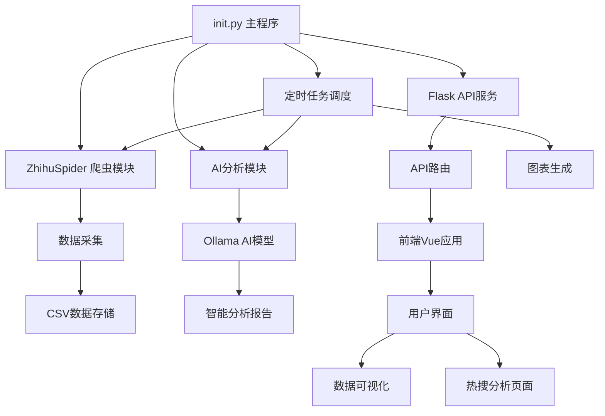
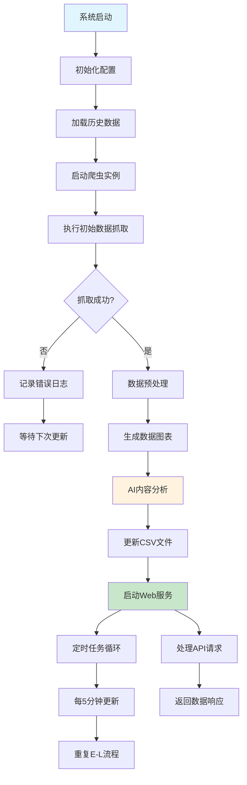
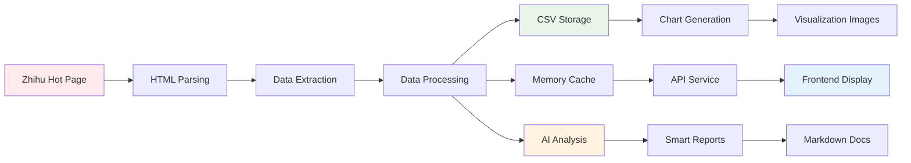

# 社交媒体数据分析平台 - 项目技术报告

## 📋 项目概述

**项目名称**: 社交媒体数据分析平台 (Social Media Data Analytics Platform)  
**版本**: 2.0.0-flask  
**开发时间**: 2025年  
**项目类型**: 全栈Web应用 + 数据分析平台  

### 项目简介
本项目是一个集成了数据爬取、实时分析、AI智能总结和可视化展示的综合性社交媒体数据分析平台。主要针对知乎热搜数据进行实时监控、深度分析和智能化处理，为用户提供热点趋势洞察和数据可视化服务。

---

## 🏗️ 系统架构设计

### 整体架构
```
┌─────────────────┐    ┌─────────────────┐    ┌─────────────────┐
│     前端层      │    │     后端层      │    │    数据层       │
│   Vue.js + UI   │◄──►│  Flask + API    │◄──►│ CSV + 文件系统  │
└─────────────────┘    └─────────────────┘    └─────────────────┘
         │                       │                       │
         ▼                       ▼                       ▼
┌─────────────────┐    ┌─────────────────┐    ┌─────────────────┐
│   用户交互界面   │    │   业务逻辑处理   │    │   数据存储管理   │
│   - 热搜展示    │    │   - 数据爬取     │    │   - CSV文件     │
│   - 图表可视化   │    │   - AI分析      │    │   - 日志记录     │
│   - 智能分析     │    │   - 定时任务     │    │   - 图片资源     │
└─────────────────┘    └─────────────────┘    └─────────────────┘
```

### 核心组件关系图


---

## 🔧 技术栈详解

### 后端技术栈

#### 1. **核心框架与库**
- **Flask 3.1.1**: 轻量级Web框架，提供RESTful API服务
- **Flask-CORS 6.0.0**: 跨域资源共享支持，确保前后端分离架构正常运行
- **Requests 2.25.1+**: HTTP客户端库，用于网络请求和API调用

#### 2. **数据处理与分析**
- **Pandas 1.3.0+**: 数据处理和分析的核心库
- **NumPy 1.21.0+**: 科学计算和数组操作基础库
- **Matplotlib 3.5.0+**: 数据可视化和图表生成
- **Seaborn 0.11.0+**: 统计数据可视化增强库

#### 3. **网络爬虫技术**
- **Requests + urllib**: 网络请求处理
- **lxml 4.6.0+**: XML/HTML解析器，高性能数据提取
- **BeautifulSoup4 4.9.0+**: HTML/XML解析和数据提取
- **自定义反爬虫策略**: Cookie管理、请求头伪装、重试机制

#### 4. **AI智能分析**
- **Ollama Client**: 本地大语言模型调用客户端
- **DeepSeek-R1:8B**: 本地部署的AI模型，用于热搜内容分析和总结

#### 5. **任务调度与并发**
- **Schedule 1.1.0+**: 定时任务调度框架
- **Threading**: 多线程并发处理
- **Queue**: 线程安全的队列管理

#### 6. **文本处理与可视化**
- **WordCloud 1.8.0+**: 词云图生成
- **Jieba 0.42.0+**: 中文分词处理
- **Pillow 8.3.0+**: 图像处理和操作

### 前端技术栈

#### 1. **核心框架**
- **Vue.js 3.5.13**: 渐进式JavaScript框架，采用Composition API
- **Vue Router 4.5.0**: 官方路由管理器
- **Vite 6.0.11**: 现代化构建工具，快速开发和热重载

#### 2. **UI框架与设计**
- **Vuetify 3.8.7**: Material Design组件库
- **MDI Font 7.4.47**: Material Design图标字体
- **响应式设计**: 支持PC和移动端自适应

#### 3. **开发工具**
- **Vite Plugin Vue 5.2.1**: Vue组件编译插件
- **Vue DevTools 7.7.0**: 开发调试工具

#### 4. **功能特性**
- **Marked 15.0.6**: Markdown解析和渲染
- **主题切换**: 支持明/暗主题模式
- **移动端优化**: 触摸友好的用户界面

---

## 🚀 项目创新点

### 1. **智能化数据分析**
- **本地AI集成**: 使用Ollama本地部署的DeepSeek-R1模型，避免数据泄露风险
- **自动化内容分类**: AI自动将热搜内容按主题分类（社会、娱乐、科技等）
- **智能摘要生成**: 对热搜话题进行深度分析和总结

### 2. **实时数据监控系统**
- **定时自动更新**: 每5分钟自动抓取最新热搜数据
- **增量数据处理**: 智能识别新增和变化的热搜内容
- **数据版本管理**: 自动生成数据快照，支持历史数据追踪

### 3. **多维度数据可视化**
- **动态图表生成**: 实时生成热度趋势图、排名变化图
- **词云分析**: 基于热搜标题生成热点词汇可视化
- **交互式数据展示**: 支持数据筛选、搜索和详细查看

### 4. **高可用性架构设计**
- **异常处理机制**: 完善的错误处理和日志记录系统
- **反爬虫策略**: 多重反爬虫措施确保数据采集稳定性
- **资源优化**: 多线程并发处理，提高数据处理效率

---

## ⭐ 技术亮点

### 1. **先进的爬虫技术**
```python
# 智能重试机制
def request_with_retry(url, max_retries=MAX_RETRIES, timeout=TIMEOUT):
    for attempt in range(max_retries):
        try:
            # 请求处理逻辑
            return response
        except Exception as e:
            if attempt == max_retries - 1:
                raise
            time.sleep(2)  # 退避策略
```

**特点**:
- Cookie自动管理和更新
- 请求头智能伪装
- exponential backoff重试策略
- 多线程并发抓取优化

### 2. **现代化前端架构**
```vue
<!-- 响应式组件设计 -->
<template>
  <v-app :theme="theme.global.name.value">
    <v-navigation-drawer v-model="drawer" app>
      <!-- 移动端优化导航 -->
    </v-navigation-drawer>
    <v-main>
      <!-- 内容区域 -->
    </v-main>
  </v-app>
</template>
```

**特点**:
- Vue 3 Composition API最佳实践
- Material Design现代化UI
- 响应式设计适配多端
- 组件化开发模式

### 3. **智能数据处理流水线**
```python
def zhihu_update(zhihu):
    # 数据采集
    change = zhihu.run(key)
    if change:
        # 图表生成
        draw_chart(csv_path, font_path, output_dir)
        # AI分析
        hot_list_analyse(csv_path, doc_dir)
        # 智能总结
        hot_answer_analyse(zhihu_hot_list, doc_dir)
```

**特点**:
- 自动化数据处理流程
- 多格式数据输出支持
- 实时图表更新机制
- AI驱动的内容分析

### 4. **高性能API设计**
```python
@api_bp.route('/hot', methods=['GET'])
def get_hot_data():
    # 支持ID查询和列表查询
    id_param = request.args.get('id')
    if id_param:
        # 返回详细信息
    else:
        # 返回概览数据
```

**特点**:
- RESTful API设计规范
- 灵活的查询参数支持
- 完善的错误处理机制
- 分页和搜索功能集成

---

## 📊 系统流程图

### 主要业务流程


### 数据处理流程


---

## 🔍 核心功能模块

### 1. **数据采集模块 (zhihu_spider.py)**
- **实时爬取**: 定时获取知乎热搜榜数据
- **多线程处理**: 并发处理提高采集效率
- **异常处理**: 完善的错误恢复机制
- **数据验证**: 确保采集数据的完整性和准确性

### 2. **AI分析模块 (AI_analyse.py)**
- **本地AI模型**: 集成Ollama DeepSeek-R1模型
- **主题分类**: 自动将热搜按类别进行分组
- **内容摘要**: 生成热搜话题的智能总结
- **趋势分析**: 识别热点话题的发展趋势

### 3. **数据可视化模块 (draw_chart.py)**
- **动态图表**: 生成热度变化趋势图
- **词云图**: 基于热搜标题的关键词可视化
- **排名分析**: 热搜排名变化的可视化展示
- **多格式输出**: 支持PNG、SVG等多种图片格式

### 4. **Web服务模块 (app.py + api_routes.py)**
- **RESTful API**: 标准化的数据接口设计
- **跨域支持**: CORS配置支持前后端分离
- **错误处理**: 统一的异常处理和响应格式
- **接口文档**: 自动化的API文档生成

### 5. **前端展示模块 (Vue.js)**
- **响应式设计**: 适配PC端和移动端
- **实时更新**: WebSocket或轮询机制实现数据实时同步
- **交互体验**: 流畅的用户交互和动画效果
- **主题切换**: 支持明暗主题模式切换

---

## 🛠️ 部署与运维

### 系统要求
- **操作系统**: Windows 10/11, Linux, macOS
- **Python版本**: 3.8+
- **Node.js版本**: 16.0+
- **内存要求**: 最低2GB，推荐4GB+
- **存储空间**: 至少1GB可用空间

### 部署步骤
1. **后端部署**:
   ```bash
   pip install -r requirements.txt
   python init.py
   ```

2. **前端部署**:
   ```bash
   cd index/vue
   npm install
   npm run dev
   ```

3. **AI模型部署**:
   ```bash
   # 安装Ollama
   ollama pull deepseek-r1:8b
   ```

### 监控与维护
- **日志系统**: 完整的操作日志记录
- **性能监控**: 内存、CPU使用率监控
- **数据备份**: 定期数据备份策略
- **错误告警**: 异常情况自动告警机制

---

## 📈 项目优势与特色

### 技术优势
1. **全栈技术栈**: 前后端技术栈完整且现代化
2. **AI集成**: 本地AI模型确保数据安全和隐私保护
3. **高可扩展性**: 模块化设计支持功能扩展
4. **跨平台支持**: 支持多操作系统部署

### 业务优势
1. **实时性**: 5分钟更新周期确保数据时效性
2. **智能化**: AI驱动的内容分析和分类
3. **可视化**: 多维度数据图表展示
4. **用户体验**: 现代化UI设计和交互体验

### 创新特色
1. **本地AI部署**: 避免数据外泄，保护用户隐私
2. **自动化流水线**: 从数据采集到分析展示的全自动化
3. **多端适配**: PC和移动端的无缝体验
4. **开源架构**: 可定制化程度高，便于二次开发

---

## 🔮 未来发展规划

### 短期目标 (1-3个月)
- [ ] 增加更多社交媒体平台支持（微博、抖音等）
- [ ] 优化AI分析算法，提高分析准确性
- [ ] 添加用户个性化推荐功能
- [ ] 完善移动端用户体验

### 中期目标 (3-6个月)
- [ ] 集成更多AI模型选择
- [ ] 添加数据导出功能（Excel、PDF等）
- [ ] 实现用户系统和权限管理
- [ ] 开发数据分析报告订阅功能

### 长期目标 (6-12个月)
- [ ] 构建大数据分析平台
- [ ] 集成机器学习预测模型
- [ ] 开发商业智能BI功能
- [ ] 支持私有化部署解决方案

---

## 📝 总结

本项目成功构建了一个集数据采集、AI分析、可视化展示于一体的现代化社交媒体数据分析平台。通过采用先进的技术栈和创新的架构设计，实现了高效、稳定、智能的数据处理和分析能力。

项目的核心价值在于：
1. **技术先进性**: 采用最新的前后端技术栈
2. **功能完整性**: 覆盖数据采集到展示的完整流程
3. **智能化程度**: 集成AI进行自动化内容分析
4. **用户体验**: 现代化的界面设计和交互体验
5. **可扩展性**: 模块化架构支持功能扩展

该平台不仅展示了全栈开发的技术实力，更体现了对现代数据分析需求的深度理解和技术创新能力。

---

*报告生成时间: 2025年5月31日*  
*版本: v1.0*  
*作者: 雏雁计划团队*
