# 社交媒体数据分析平台 - 项目流程图

## 🔄 数据处理流程图

```mermaid
graph TD
    A[系统启动 init.py] --> B[加载配置和历史数据]
    B --> C[初始化爬虫实例]
    C --> D[执行首次数据抓取]
  
    D --> E{数据抓取成功?}
    E -->|失败| F[记录错误日志]
    F --> G[等待下次更新周期]
    E -->|成功| H[数据预处理和清洗]
  
    H --> I[保存到CSV文件]
    I --> J[更新内存中的热搜列表]
  
    J --> K[生成可视化图表]
    K --> L[调用AI进行内容分析]
    L --> M[生成AI分析报告]
  
    M --> N[启动Flask Web服务]
    N --> O[设置定时任务 每5分钟]
  
    O --> P[定时器触发]
    P --> Q[重新执行数据抓取]
    Q --> E
  
    N --> R[接收前端API请求]
    R --> S{请求类型判断}
  
    S -->|热搜列表| T[返回zhihu_hot_name数据]
    S -->|热搜详情| U[根据ID返回详细信息]
    S -->|搜索请求| V[关键词匹配搜索]
    S -->|状态检查| W[返回系统状态信息]
  
    T --> X[JSON响应返回前端]
    U --> X
    V --> X
    W --> X
  
    G --> P
  
    style A fill:#e1f5fe
    style H fill:#e8f5e8
    style K fill:#fff3e0
    style L fill:#f3e5f5
    style N fill:#c8e6c9
    style X fill:#e3f2fd
```

## 🤖 AI分析处理流程图

```mermaid
graph TD
    A[AI分析模块启动] --> B[读取CSV热搜数据]
  
    B --> C[热搜列表分析 hot_list_analyse]
    C --> D[连接Ollama本地AI服务]
    D --> E[调用DeepSeek-R1:8B模型]
  
    E --> F[发送热搜标题数据给AI]
    F --> G[AI进行主题分类和分析]
    G --> H[生成分类总结报告]
    H --> I[保存为Markdown文档]
  
    B --> J[热搜回答分析 hot_answer_analyse]
    J --> K{检查是否已生成AI总结}
    K -->|已生成| L[跳过此条目]
    K -->|未生成| M[提取热搜回答内容]
  
    M --> N[发送回答内容给AI模型]
    N --> O[AI生成内容摘要]
    O --> P[标记为已生成总结]
    P --> Q[保存AI总结到文档]
  
    L --> R[处理下一条目]
    Q --> R
    R --> S{是否还有未处理数据?}
    S -->|是| K
    S -->|否| T[AI分析完成]
  
    I --> U[前端可访问分析报告]
    T --> U
  
    style A fill:#f3e5f5
    style E fill:#fff3e0
    style H fill:#e8f5e8
    style O fill:#e3f2fd
    style T fill:#c8e6c9
```

## 🌐 前后端交互流程图

```mermaid
sequenceDiagram
    participant U as 用户
    participant F as Vue前端
    participant A as Flask API
    participant D as 数据层
    participant AI as AI模块
  
    U->>F: 访问主页
    F->>A: GET /api/hot (获取热搜列表)
    A->>D: 读取zhihu_hot_name
    D-->>A: 返回热搜数据
    A-->>F: JSON响应 (热搜列表)
    F-->>U: 展示热搜列表界面
  
    U->>F: 点击热搜项目
    F->>A: GET /api/hot?id=xxx (获取详情)
    A->>D: 根据Hash查找详细数据
    D-->>A: 返回热搜详情
    A-->>F: JSON响应 (详细信息)
    F-->>U: 跳转到分析页面
  
    U->>F: 查看AI分析
    F->>A: 获取AI分析文档
    A->>D: 读取Markdown分析报告
    D-->>A: 返回分析内容
    A-->>F: 渲染Markdown内容
    F-->>U: 展示AI分析结果
  
    Note over A,AI: 后台定时任务
    A->>AI: 定时触发AI分析
    AI->>D: 生成新的分析报告
    D-->>AI: 保存分析结果
  
    U->>F: 搜索热搜
    F->>A: GET /api/search?keyword=xxx
    A->>D: 关键词匹配搜索
    D-->>A: 返回匹配结果
    A-->>F: JSON响应 (搜索结果)
    F-->>U: 展示搜索结果
```

## 🔐 错误处理和日志流程图

```mermaid
graph TD
    A[系统运行] --> B{发生异常?}
    B -->|否| C[正常执行]
    C --> A
  
    B -->|是| D[捕获异常信息]
    D --> E[确定异常类型]
  
    E --> F{网络请求异常?}
    F -->|是| G[启动重试机制]
    G --> H[记录重试日志]
    H --> I{重试次数超限?}
    I -->|否| J[等待后重试]
    J --> A
    I -->|是| K[记录失败日志]
  
    E --> L{数据处理异常?}
    L -->|是| M[记录数据错误]
    M --> N[跳过当前数据]
    N --> O[继续处理下一项]
  
    E --> P{AI分析异常?}
    P -->|是| Q[记录AI服务错误]
    Q --> R[标记分析失败]
    R --> S[使用默认分析结果]
  
    E --> T{其他系统异常?}
    T -->|是| U[记录系统错误]
    U --> V[尝试系统恢复]
  
    K --> W[写入日志文件]
    M --> W
    Q --> W
    U --> W
  
    W --> X[日志格式化输出]
    X --> Y[持久化存储]
  
    O --> A
    S --> A
    V --> A
  
    style D fill:#ffebee
    style W fill:#fff3e0
    style Y fill:#e8f5e8
```

---

*流程图生成时间: 2025年5月31日*
*版本: v1.0*
*工具: Mermaid + Markdown*
